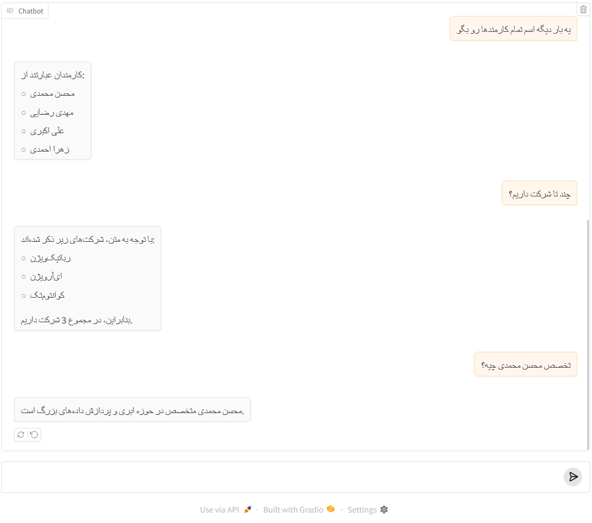

# اجرای مدل زبانی Gemma3:12B به صورت محلی با Ollama

این نوت‌بوک‌‌ها به شما امکان می‌دهد که به راحتی مدل زبانی Gemma3:12B یا هر مدل دیگری را به طور محلی با استفاده از Ollama و Langchain اجرا کنید. این یک روش مناسب برای آزمایش این مدل قدرتمند بدون نیاز به API‌های خارجی است.

## لیست پروژه‌ها
*   **ربات چت ساده بر پایه gemma3:12b (یا هر مدل دیگر)**
*   **ربات چت RAG با استفاده از پایگاه دانش با محتوای فارسی برای پاسخ‌گویی دقیق**
*   **شاید ادامه داشته باشد...**

## نصب و راه‌اندازی

این پروژه نیازی به تنظیمات جداگانه ندارد. فقط کافی است سلول‌های هر Jupyter Notebook را به ترتیب از ابتدا اجرا کنید.

## نحوه استفاده

به راحتی می‌توانید از این پروژه برای اهداف خوب استفاده کنید. این ابزار بدون نیاز به تماس با API، داده‌ها و درخواست‌ها را ایمن نگه داشته و بدون هیچ هزینه‌ای در اختیار شما قرار می‌دهد.

## تصاویر

## مشکلات بالقوه و رفع اشکال

*   **Ollama پیدا نشد:** مطمئن شوید که Ollama به درستی نصب شده و در PATH سیستم شما قابل دسترسی باشد. اطمینان حاصل کنید که Ollama در حال اجرا است.
*   **خطاهای دانلود:** اگر در حین دانلود مدل با خطا مواجه شدید، اتصال اینترنت و فضای دیسک موجود را بررسی کنید. سعی کنید کش Ollama را پاک کنید: `ollama cache clean`.
*   **محدودیت منابع:** اجرای مدل‌های زبانی بزرگ نیازمند منابع محاسباتی قابل توجهی (CPU، RAM، GPU) است. اگر با مشکلات عملکردی یا خطاهایی مواجه شدید، سعی کنید از مدل کوچک‌تری از gemma3 یا مدل دیگری استفاده کنید.
*   **تضاد نسخه مدل:** مطمئن شوید که نام مدل استفاده شده در Notebook (`gemma3:12b`) با نسخه‌ای که با Ollama دریافت کرده‌اید مطابقت دارد.

## مشارکت

از شما دعوت می‌شود که این مخزن را فورک کنید و درخواست‌های تغییر یا رفع اشکال را ارسال نمایید.

## مجوز

مجوز MIT

# Run Gemma3:12B LLM locally with Ollama

These Jupyter Notebooks allow you to easily run the Gemma3:12B LLM or any others locally using Ollama and Langchain.  It's a convenient way to experiment with this powerful model without relying on external APIs.

## List of Projects
*   **Simple ChatBot based on gemma3:12b (or any other)**
*   **RAG ChatBot using a knowledge base with persian contexts for answering accuratly**
*   **Maybe Continue...**

## Setup

It does not have any seprated setup. just run every notebook cells sequentially from the first.

## Usage

Feel free to use it for good purposes. these are for you without any api call for security of data and requests without any pay.

## Screenshot

## Potential Issues & Troubleshooting

*   **Ollama Not Found:**  Ensure Ollama is installed correctly and accessible in your system's PATH.  Verify Ollama is running.
*   **Download Errors:** If you encounter errors during the model download, check your internet connection and available disk space.  Try clearing your Ollama cache: `ollama cache clean`.
*   **Resource Constraints:** Running large language models requires significant computational resources (CPU, RAM, GPU).  If you experience performance issues or errors, try using a smaller model of gemma3 or another.
*   **Model Version Conflicts:**  Make sure the model name used in the notebook (`gemma3:12b`) matches the version you have pulled with Ollama.

## Contributing

Feel free to fork this repository and submit pull requests for improvements or bug fixes.

## License

MIT License
